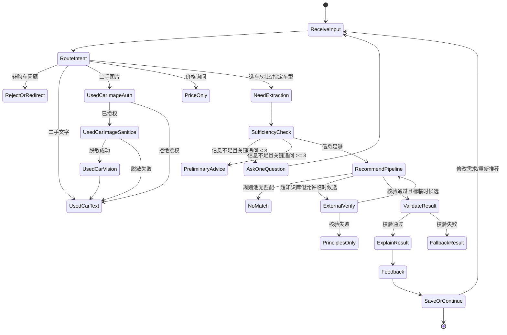
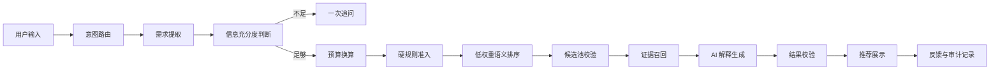
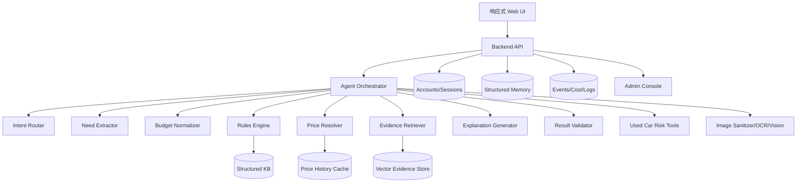

# MotoMate Agent 需求与架构设计 V0.1

创建日期：2026-08-29  
适用阶段：Agent 设计与实施拆解前置文档  
当前状态：V0.1 的 11 个设计阶段均已获 Ethan 确认，作为实施前设计基线；文中明确标注的建议、待确认项和实施阻塞项不视为已实现能力。
事实核查范围：`项目长期记忆.md`、`MVP产品需求文档.md`、`访谈记录整理.md`、`system_prompt.md`、`知识库状态与准入规则V0.2.md`、`README.md`、`rules-engine.js`、第一批正式规则池、语义增强层、知识库与模型路由校验报告。

## 阶段确认状态

| 阶段 | 内容 | 状态 |
|---:|---|---|
| 1 | 核心用户任务、Agent 范围与成功标准 | Ethan_confirmed |
| 2 | 意图路由 | Ethan_confirmed |
| 3 | 需求字段与对话状态机 | Ethan_confirmed |
| 4 | 推荐执行链路 | Ethan_confirmed |
| 5 | 编排器/工具及多 Agent 边界 | Ethan_confirmed |
| 6 | 数据契约 | Ethan_confirmed |
| 7 | 价格与知识库 | Ethan_confirmed |
| 8 | 二手助手 | Ethan_confirmed |
| 9 | 记忆、隐私与安全 | Ethan_confirmed |
| 10 | 可观测性与评测 | Ethan_confirmed |
| 11 | 实施路线、PRD/Prompt 审查和面试叙事 | Ethan_confirmed |

说明：阶段状态表示设计决策已确认，不表示对应功能已经实现。技术建议、待确认项和实施阻塞项仍需在后续实施阶段处理。

## 0. 事实基线与边界

### 0.1 已确认事实

- 产品主叙事：新手选车推荐是核心流程，轻量二手车助手是辅助亮点。
- MVP 首发形态：响应式网页应用；手机端服务真实测试，桌面端兼顾面试展示。
- 推荐原则：确定性规则筛选 + 低权重语义排序 + AI 解释；AI 不得绕过候选池凭空推荐。
- 当前工程状态：现有网页是静态演示原型；后端、模型编排、账户、后台、联网核价、二手图片能力均未实现。
- 当前正式规则池：`knowledge_base_outputs/eligible_pool/first_batch_v1.json`，8 个配置，`eligible_count=8`，`recommendation_approved_count=0`。
- 当前语义层：`first_batch_semantic_v0.1` 已通过确定性校验，并获 Ethan 产品策略 A 批准，可低权重用于内部排序测试；这不是逐字段事实人工核验，也不是最终推荐批准。
- Ethan 已确认：内部 Alpha 阶段允许使用当前 8 个 `eligible` 但未 `approved` 的配置做受控推荐预览，必须标记为 `development_preview`，不得对外宣称为正式推荐批准。
- Ethan 已确认：意图路由采用“主意图优先”。当用户一句话混合多个需求时，先处理最核心的选车/车型判断/对比任务，其他需求作为后续入口或补充提示，不在同一轮并行展开多个复杂流程。
- Ethan 已确认：新手推荐的最低信息门槛为“预算 + 主要用途 + 新车/二手偏好”。三项齐备后可进入推荐；车型方向不是必填项。新车/二手偏好不得由系统静默默认，缺失时应作为关键追问。
- Ethan 已确认：硬规则筛选无完全匹配时，可以单独展示“最接近候选”，但必须逐项标出未满足条件并声明其不是正式推荐；只有用户明确同意放宽条件后，才能基于新条件重新执行推荐，不得由系统自动放宽。
- Ethan 已确认：MVP 用户实时推荐流程禁止启动独立 Agent，只使用一个编排器调用模块化工具；联网查询可作为受控工具调用并行执行。独立 Agent 仅用于离线知识库扩建、批量评测、失败归因等不在用户关键路径上的任务。
- Ethan 已确认：知识库缺失值采用分级处理。当前在售、价格、推荐资格等决定准入的硬字段缺失时，不得进入正式候选；风格、动力感受等仅影响排序的语义字段缺失时按中性值处理，不插补、不加分也不扣分。
- Ethan 已确认：价格准入按新车与二手车分场景处理。新车沿用价格策略 A，以官网公开价格为基础；存在同版本、同配置、同口径且 24 小时内核验的合格平台参考价时，预算保护价取两者较高值，较低促销价只作参考。二手车不得直接用新车官方售价做准入，改由二手助手使用独立的车源报价与风险核查逻辑。
- Ethan 已确认：首轮 10-20 人测试只上线轻量二手文字助手，不开放二手图片分析。图片路线保留为首轮测试后的候选迭代，只有核心价值验证通过，并完成视觉任务专项评测、隐私授权、脱敏、供应商条款和删除链路验收后才可开放。
- Ethan 已确认：登录本身不构成长期保存授权。匿名用户和未主动保存的登录用户，其结构化购车状态只在当前会话内使用；只有用户主动点击保存后，确认后的结构化购车记录才进入账户并适用 180 天未登录清理规则。
- Ethan 已确认：评测采用分层运行。20 条工程冒烟在代码、Prompt、规则或知识库变更后自动运行；50 条黄金评测在上线前，以及模型、规则或推荐策略发生实质变化时运行，作为发布门槛。
- Ethan 已确认：内部 Alpha 先用现有 8 个规则池配置跑通完整链路，全部标记为 `development_preview`；端到端链路稳定后再扩充到 12-15 款，不以扩库作为开始实现的前置条件。
- 目标外部 MVP 知识库：约 25-35 款车型；内部 Alpha 先用现有 8 个配置跑通链路，再扩充到 12-15 款验证覆盖度。
- 价格策略：cache-first / stale-while-revalidate 已确认但尚未实现；失败或超时保留旧值，不得用模型记忆补价。
- 会话与隐私规则：默认携带白名单长期偏好、最近约 20 轮消息、24 小时内滚动摘要和当前问题；短期上下文 24 小时自动删除，长期偏好 180 天未使用自动删除；二手原图当次分析完成或终止后删除。
- 首轮测试：10-20 位目标用户，前 5 位深度可用性测试，后续陌生用户验证；费用硬上限 50 元，达到后进入基础模式。
- 智谱资源边界：Ethan 反馈权益当前约还剩 6 天且资源包每日重置；该信息来自账户使用反馈，截图未独立显示到期日或每日重置规则，不得写成平台核验事实。2026-08-29 截图可确认资源包当时均为生效中，并显示约 `glm-4.7` 5,000,000 tokens、`glm-4.6v` 6,000,000 tokens、`glm-4.5-air` 11,978,637 tokens、通用按 Token 1,785,656 tokens，另有 86 次搜索和 20 次按次调用。

### 0.2 待验证产品假设

- 初始排序权重是否符合新手真实决策：用途 25、人体适配 15、新手友好与安全 20、总成本余量 15、维护便利 10、外观/动力 15。
- 语义 V0.1 中 `usage_tags`、`operation_pressure_level`、`beginner_friendliness`、`style_tag`、`power_band` 对实际推荐满意度的贡献。
- “最多 3 次关键追问”是否在真实用户中兼顾效率和推荐质量。
- 二手图片辅助是否显著提升车源风险沟通效率。
- 邀请码机制和 20 人容量是否足以收集有效反馈。

### 0.3 技术建议

- MVP 使用“一个编排器 + 模块化工具”，优先确定性程序规则，模型只负责语言理解、解释生成和非结构化信息抽取。
- 用户实时流程不启动独立 Agent；仅对相互独立、可确定性合并且能降低等待时间的窄工具调用做受控并行。独立 Agent 只用于离线知识库与评测任务。
- 规则池、语义层、价格历史、证据库、会话记忆分库存储或至少分表管理，避免 prompt 继续膨胀为事实数据库。
- 上线前必须补齐后端、数据库、认证、限额、费用监控、后台、价格刷新、模型调用审计和隐私授权链路。
- 高 Token 的资料采集、证据整理、批量抽取和评测初筛可优先使用本机已配置的智谱 API；当前产品确认和文档结构设计阶段无需为了额度主动调用模型。文本抽取优先考虑已通过基准的 `glm-4.7`；图片任务中的 `glm-4.6v` 仍需按具体视觉任务验证。不得为了消耗额度扩大 MVP 范围，不得用模型输出替代来源核验、确定性校验或 Ethan 决策；API Key 只能从本机环境变量读取。

### 0.4 后续实施待决策

- 12-15 款 Alpha、25-35 款外部 MVP 的具体配置清单；正式推荐批准的责任机制和记录 Schema 已确认，尚待产生首个真实批准批次。
- 正式上线时使用哪个模型供应商处理真实用户文本；需核查 API 数据训练、保留、地区和条款。二手图片/OCR 供应商推迟到首轮测试后决策。
- 免费/低成本部署平台、后端和数据库选型。

## 1. Agent 产品需求

### 1.1 核心用户任务

| 用户任务 | 典型输入 | Agent 目标 | PRD 追踪 |
|---|---|---|---|
| 新手不知道买什么 | “2 万预算，上下班，偶尔周末玩” | 低打扰识别需求，输出 1-3 款候选和明确首选 | 7.1、8.1、8.2、8.4 |
| 已有候选车型 | “UHR150、PCX160、NMAX 怎么选” | 围绕指定车型比较，不擅自扩大全市场 | 7.2、8.5 |
| 指定车型是否值得买 | “450CL-C 适合新手吗” | 判断是否适合当前需求，必要时给替代方向 | 7.3、8.4、10 |
| 预算和总成本 | “3 万落地能买什么” | 识别预算口径，换算可用裸车预算，展示成本拆分 | 8.6、17 |
| 轻量二手风险 | 首轮使用车源文字；截图和车辆照片为首轮测试后候选 | 输出信息缺口、风险点、卖家问题和线下验车清单 | 8.7、12 |
| 保存和复盘 | 保存推荐、提交反馈、查看历史 | 保存结构化记录，支持删除和生命周期管理 | 8.8、8.9、9.4 |

### 1.2 范围

P0 范围：

- 自然语言购车问诊。
- 需求明确度判断与一次只问一个问题。
- 预算口径识别与购车总成本估算。
- 基于正式规则池的确定性候选筛选。
- 低权重语义排序，仅作为内部排序信号。
- AI 解释推荐理由、妥协点、风险和下一步。
- 指定车型判断和最多 3 款横向对比。
- 轻量二手文字风险助手；图片辅助不进入首轮 10-20 人测试，保留为测试后候选迭代。
- 推荐反馈、账户保存、结构化记忆、最小运营后台、邀请码和费用上限。

不在 P0：

- 车源交易平台、支付担保、车商入驻、检测履约。
- 维修、保养、改装、骑行教学和故障诊断。
- 事故车、泡水车、调表车最终鉴定。
- 推荐结果分享链接或海报。
- 城市政策自动总结；只给官方查询入口和核验时间。

### 1.3 输入输出

输入：

- 用户自然语言文本。
- 可选快捷项：预算、用途、车型偏好、新车/二手偏好。
- 可选结构化信息：身高、经验、城市、驾驶证状态、候选车型、明确排斥项。
- 二手助手首轮输入：车源文字、年份、里程、价格、地区、卖家描述。挂牌截图和车辆照片仅属于首轮测试后的图片路线。

输出：

- 需求摘要和已识别字段。
- 追问：最多一个问题，且只在可能改变推荐结果时问。
- 推荐结果：1-3 款，含首选/次选/备选、理由、缺点、适合/不适合人群、预算拆分、依据入口。
- 对比结果：最多 3 款的维度比较、排序和场景建议。
- 二手风险结果：信息提取、缺口、风险、卖家问题、线下核查清单、非鉴定声明。
- 异常结果：失败环节、现有数据状态、可重试动作或基础模式说明。

### 1.4 成功状态

- 需求识别足够：预算或预算追问完成、主要用途明确、车型方向可判断、新车/二手偏好已明确为新车、二手或两者都可以，不允许静默默认。
- 推荐生成成功：所有正式推荐车型通过预算、在售、规则池准入和结果校验；AI 解释只引用候选池事实。
- 用户可理解：首屏给明确结论，每款至少一个真实缺点或风险。
- 用户反馈有效：5 分帮助度 + 具体帮助标签 + 一句说明；4 分及以上且能说出具体帮助才计入成功样本。

### 1.5 失败状态

- 信息不足：关键字段缺失且已达到 3 次关键追问，输出初步方向与缺失影响。
- 无匹配：规则池中无符合预算/用途/偏好的完全匹配项。可另列规则池内的最接近候选及其未满足条件，但不得冒充正式推荐或自动放宽用户条件。
- 超知识库：说明覆盖不足；可启动临时候选核验，但核验失败时只给选车原则。
- 数据过期或冲突：展示旧值与状态；同口径真实冲突不得进入正式推荐。
- 模型失败：回退模板解释或要求重试，保留规则筛选结果。
- 费用上限：进入基础模式，停止付费模型请求。
- 图片授权/脱敏失败（首轮测试后能力）：停止外部视觉调用，保留纯文字二手助手。

### 1.6 非功能需求

- 延迟：2 秒内展示需求摘要或处理进度；缓存命中普通问诊 10 秒内；联网核验完整推荐目标 20 秒；30 秒强制超时。二手图片 30 秒目标、60 秒强制超时仅作为首轮测试后的预留指标。
- 成本：首轮 20 人测试模型费用硬上限 50 元；记录文本抽取、解释等调用的 usage 和费用。图片成本在后续启用时单独纳入。
- 可审计：每次推荐保存需求快照、规则版本、数据版本、候选池、过滤原因、证据引用、模型版本、校验结果。
- 安全：用户隐私最小化采集；敏感数据脱敏；真实 API Key 不进入文档、代码和日志。
- 稳定：模型、联网、抓取任一环节失败时有明确降级路径；后续图片能力也必须独立降级到文字助手。

### 1.7 PRD 需求追踪矩阵

| 本设计需求组 | PRD 对应章节 | 当前关系 |
|---|---|---|
| 核心用户、产品范围与成功标准 | 3、4、5、6、16 | 一致 |
| 自然语言问诊、充分度与追问 | 7.1、8.1、8.2、10 | 最低门槛已更新为预算 + 用途 + 新车/二手偏好，PRD 待同步 |
| 候选准入、推荐解释与结果校验 | 8.3、8.4、9、10 | 架构细化为规则筛选 + 低权重排序 + AI 解释 |
| 指定车型与多车对比 | 7.2、7.3、8.5 | 一致 |
| 预算、总成本与价格刷新 | 8.6、9.2、12 | 架构补充价格策略 A、缓存和冲突处理 |
| 轻量二手助手 | 8.7、11.5、12、15 | 首轮只保留文字路线，PRD 图片条款待移至测试后版本 |
| 反馈、账户、记忆与生命周期 | 8.8、8.9、9.4、12、13 | 架构补充主动保存边界与管理员审计 |
| 性能、成本、安全和异常状态 | 12、12.1、14、16 | 架构补充超时、重试、熔断和基础模式 |

## 2. 意图路由表

| 意图 | 识别信号 | 必需上下文 | 路由模块 | 输出 | 失败/降级 |
|---|---|---|---|---|---|
| 新手不知道买什么 | “不知道买啥”“帮我推荐”“预算 X” | 预算、用途、新车/二手偏好；车型偏好可缺省 | NeedExtractor -> SufficiencyChecker -> RecommendationPipeline | 1-3 款推荐 | 不足则最多追问 3 次；无完全匹配时可分区展示带差距说明的最接近候选 |
| 已有候选车型 | 多个车型名、“怎么选” | 候选列表、用途或预算 | EntityResolver -> ComparePipeline | 最多 3 款对比和排序 | 超过 3 款先按已知需求筛 3 款 |
| 指定车型是否值得买 | 单车型名、“能买吗/值不值” | 车型名；需求不足时问预算或用途 | EntityResolver -> SingleModelEvaluator | 是否适合、优缺点、替代方向 | 车型不在库则进入超范围核验 |
| 多车对比 | “A 和 B”“A/B/C” | 2-3 个车型；预算/用途越多越好 | ComparePipeline | 表格比较 + 结论 | 缺关键条件只问一个问题 |
| 预算口径与总成本 | “落地”“裸车”“3 万够吗” | 预算数值、口径 | BudgetNormalizer -> CostEstimator | 裸车可用预算、购车总成本和首年持有成本 | 口径不明只追问一次 |
| 轻量二手文字风险 | “这个二手车源”“里程/年份/价格” | 车源文字或字段 | UsedTextRiskTool | 信息缺口、风险、问题清单 | 无行情则不判断价格合理性，只列核查点 |
| 二手图片辅助（首轮测试后候选） | 上传图片/截图 | 图片授权、格式大小合规，且图片能力已通过专项验收 | ImageSanitizer -> OCR/VisionExtractor -> UsedRiskTool | 脱敏字段提取和核查提示 | 首轮不开放；后续拒绝授权/脱敏失败则转文字流程 |
| 价格询问 | “现在多少钱”“落地多少” | 车型/配置、价格口径 | PriceResolver | cache-first 价格状态、来源、时间 | 过期展示 stale 并后台刷新；无缓存显示核验失败 |
| 超知识库范围 | 未覆盖品牌/价格区间/停产新车 | 用户需求和车型名 | ExternalCandidateVerifier | 可核验则标临时候选；不可核验只给原则 | 临时候选不得直接进正式推荐 |
| 非购车问题 | 保养、维修、改装、骑行教学 | 无 | RefusalRedirector | 简短拒绝并引导回购车 | 不展开技术教程 |
| 工具或模型失败 | 超时、解析失败、熔断、费用上限 | 当前会话状态 | FallbackManager | 失败环节、可重试、基础模式 | 不无限加载，不补造事实 |

## 3. 对话状态机

### 3.1 状态图



### 3.2 需求字段与充分度

需求字段分为三类：

- 必须可判断：预算或预算口径追问结果、主要用途、新车/二手偏好。
- 影响排序：车型方向、身高、经验、动力偏好、外观偏好、载人、长途、城市、明确排斥项、候选车型。
- 仅在特定场景询问：腿长/落脚习惯、驾驶证状态、城市政策相关信息。

信息充分度规则：

- `ready_for_recommendation`：预算可换算、用途清晰、新车/二手偏好已由用户明确；车型方向允许缺失。
- `needs_one_question`：缺失字段会显著改变候选池或预算准入。
- `partial_advice_only`：关键追问已达 3 次仍不充分，输出方向和继续补充项。
- `blocked`：用户请求超出产品边界或要求输出未经核验具体结论。

### 3.3 追问规则

- 每轮只问一个问题。
- 正常推荐前最多 3 次关键追问。
- 第 1 优先级：预算口径或预算范围。
- 第 2 优先级：主要用途。
- 第 3 优先级：新车/二手偏好或关键偏好冲突。
- 身高、经验、城市、驾驶证不作为固定问卷；只有明显影响风险提醒或推荐结果时才问。

### 3.4 用户修改需求与重新推荐

- 最新用户输入覆盖旧结构化字段，但历史推荐记录不被改写。
- 修改影响候选池时，创建新的 `recommendation_version`。
- 用户点击“按新偏好重新推荐”时，保存旧版本的数据版本、规则版本和核验时间。
- 用户删除偏好字段后，该字段不得继续进入模型上下文或排序。

### 3.5 无匹配与降级

- 预算太低：说明当前规则池没有通过准入且预算内的配置；可分区展示规则池内的最接近候选及预算差额，待用户明确放宽条件后再重新推荐。
- 预算太高或品牌超范围：说明 MVP 知识库覆盖 1-3 万裸车价、8 个品牌方向，不承诺完整推荐。
- 数据过期：展示旧值、`stale` 状态和刷新中；刷新失败不覆盖旧值。
- 模型不可用：用规则筛选结果 + 固定模板解释输出基础建议。
- 费用达上限：进入基础模式，只保留规则筛选、固定模板解释、历史记录查看。

## 4. 推荐执行链路与数据契约

### 4.1 执行链路



链路边界：

- 需求提取可用模型，但输出必须落到结构化 Schema。
- 预算换算、硬规则准入、超预算判断、状态检查必须由程序执行。
- 语义排序只使用已批准低权重字段，缺失为中性，不插补。
- AI 解释只能基于候选池、证据摘要和规则输出，不可新增车型或价格。
- 结果校验需拦截预算超限、未在售、未准入、未授权字段、来源缺失和越界承诺。

### 4.2 需求提取 Schema 示例

```json
{
  "schema_version": "motomate_user_need_v0.1",
  "session_id": "anon_20260829_xxxx",
  "message_id": "msg_xxxx",
  "intent": "beginner_recommendation",
  "fields": {
    "budget": {
      "amount_cny": 30000,
      "budget_type": "total_purchase_budget",
      "confidence": 0.82,
      "source": "user_explicit",
      "raw_span": "3万落地"
    },
    "usage": {
      "primary": "urban_commute",
      "secondary": ["weekend_leisure"],
      "source": "user_explicit"
    },
    "vehicle_type_preference": {
      "value": null,
      "source": "missing"
    },
    "new_used_preference": {
      "value": "new_first",
      "source": "user_explicit"
    },
    "rider": {
      "height_cm": null,
      "experience": "beginner",
      "license_status": null
    },
    "preferences": {
      "style_tag": null,
      "power_band": null,
      "disliked_models": []
    }
  },
  "missing_fields": [],
  "sufficiency": {
    "status": "ready_for_recommendation",
    "next_question": null,
    "critical_question_count": 0
  },
  "audit": {
    "extracted_by": "model_or_rule",
    "model_name": "text_extractor_placeholder",
    "created_at": "2026-08-29T12:00:00+08:00"
  }
}
```

字段来源：

- `user_explicit`：用户明确说出，可写入结构化记忆。
- `ai_inferred`：AI 推断，必须用户确认后才能长期保存。
- `default_policy`：系统策略默认值；不得用于静默补齐已确认的推荐必需字段，例如新车/二手偏好。
- `missing`：未知，不能擅自补齐。

缺失值处理：

- 硬字段缺失：当前在售、价格、推荐资格等字段无法满足准入要求时，配置不得进入正式候选池，并记录排除原因。
- 语义字段缺失：只影响内部排序的字段使用中性值，不由 AI 插补，不加分也不扣分。
- 任何缺失值均保留 `null`、缺失原因、来源状态和数据版本，便于审计与后续补录。

### 4.3 预算换算 Schema 示例

```json
{
  "schema_version": "motomate_budget_v0.1",
  "input_budget_cny": 30000,
  "budget_type": "total_purchase_budget",
  "assumptions": {
    "tax_and_fees_cny": {"min": 1200, "max": 2200, "editable": true},
    "insurance_cny": {"min": 600, "max": 1200, "editable": true},
    "registration_cny": {"min": 200, "max": 800, "editable": true},
    "basic_gear_cny": {"min": 1500, "max": 3000, "editable": true}
  },
  "available_bare_vehicle_budget_cny": {
    "min": 22800,
    "max": 26500
  },
  "filter_budget_cny": 26500,
  "first_choice_must_not_exceed_total_budget": true,
  "backup_overrun_limit_ratio": 0.05,
  "notes": ["估算不是精确落地价", "首年持有成本不占用购车总预算"]
}
```

### 4.4 候选池与排序输出 Schema 示例

```json
{
  "schema_version": "motomate_candidate_pool_v0.1",
  "kb_pool_version": "first_batch_v1",
  "rule_version": "kb_admission_v0.2",
  "semantic_version": "first_batch_semantic_v0.1",
  "mode": "development_preview",
  "recommendation_allowed": false,
  "input_need_ref": "need_xxxx",
  "filters": {
    "sale_status": "current",
    "rule_pool_eligibility": "eligible",
    "budget_guard_price_cny_lte": 26500,
    "vehicle_type": ["踏板", "街车"]
  },
  "candidates": [
    {
      "model_id": "haojue_uhr150_2026_handrail",
      "rank": 1,
      "rank_label": "首选候选",
      "hard_rule_passed": true,
      "review_status": "codex_reviewed",
      "budget_guard_price_cny": 13780,
      "reason_codes": ["within_budget", "usage_high", "beginner_friendliness_high"],
      "internal_score": {
        "user_visible": false,
        "semantic_signal": 6,
        "missing_neutral_fields": ["maintenance_convenience"]
      },
      "evidence_refs": [
        {
          "field": "official_public_price_cny",
          "source_name": "品牌官网",
          "source_url": "https://example-official.invalid/model",
          "captured_at": "2026-08-28T14:10:00+08:00"
        }
      ],
      "audit": {
        "included_by": ["budget", "sale_status", "rule_pool_eligibility"],
        "excluded_reasons": []
      }
    }
  ],
  "excluded": [
    {
      "model_id": "example_model",
      "reason": "over_total_budget_more_than_5_percent"
    }
  ]
}
```

当前注意：在 `recommendation_approved_count=0` 的事实下，正式对外推荐应被阻断；内部 Alpha 按 Ethan 已确认的边界使用 `development_preview` 明确标记。

### 4.5 AI 解释输入 Schema 示例

```json
{
  "schema_version": "motomate_explanation_context_v0.1",
  "user_need_summary": "用户总预算约 3 万，主要城市通勤，偶尔周末休闲，新车优先。",
  "candidate_pool": ["haojue_uhr150_2026_handrail", "wuyang_honda_pcx160_2025_standard"],
  "allowed_claims": [
    {"field": "price", "claim": "官网公开价格 13780 元", "source_ref": "src_1"},
    {"field": "seat_height", "claim": "座高 760mm", "source_ref": "src_2"}
  ],
  "forbidden_claims": [
    "不得新增候选池外车型",
    "不得声称推荐已获最终批准",
    "不得将语义假设表述为客观安全保证",
    "不得输出未核验价格"
  ],
  "output_contract": {
    "max_recommendations": 3,
    "must_include": ["clear_choice", "pros", "cons", "fit", "not_fit", "next_steps"],
    "source_display": "show_summary_first_link_detail_on_demand"
  }
}
```

### 4.6 结果校验 Schema 示例

```json
{
  "schema_version": "motomate_result_validation_v0.1",
  "recommendation_id": "rec_xxxx",
  "checks": {
    "all_models_from_candidate_pool": true,
    "budget_first_choice_valid": true,
    "backup_overrun_within_5_percent": true,
    "sale_status_current": true,
    "rule_pool_eligible": true,
    "price_source_present": true,
    "no_unapproved_fact_claim": true,
    "no_second_hand_final_diagnosis": true,
    "no_external_link_purchase": true
  },
  "status": "pass",
  "failure_action": null
}
```

## 5. MVP 架构：一个编排器 + 模块化工具

### 5.1 架构图



### 5.2 组件职责

| 组件 | 职责 | 输入 | 输出 |
|---|---|---|---|
| Web UI | 对话、推荐、对比、二手、反馈、保存 | 用户输入 | API 请求、结果展示 |
| Backend API | 认证、限额、会话、记录、权限 | HTTP 请求 | 标准响应 |
| Agent Orchestrator | 动态路由、状态机、工具编排、失败降级 | 会话状态、用户消息 | 任务计划和最终结果 |
| Intent Router | 意图分类和边界判断 | 文本/上传类型 | 意图、置信度 |
| Need Extractor | 抽取购车需求字段 | 当前文本、白名单长期偏好、最近约 20 轮消息和滚动摘要 | `UserNeed` |
| Budget Normalizer | 预算口径换算 | `UserNeed` | 可用裸车预算 |
| Rules Engine | 准入筛选和内部排序 | 规则池、语义层、需求 | 候选池、过滤原因 |
| Price Resolver | 价格缓存和按需刷新 | model_id、配置、口径 | 当前价格状态 |
| Evidence Retriever | 召回可引用证据 | 候选 model_id、字段 | 证据摘要 |
| Explanation Generator | 生成自然语言解释 | 候选池、证据、限制 | 推荐文案 |
| Result Validator | 拦截越界输出 | 解释草稿、候选池 | pass/fail |
| Used Car Risk Tools | 文字车源风险 | 车源字段 | 风险和核查清单 |
| Image Sanitizer/OCR/Vision | 图片脱敏和字段抽取 | 授权图片 | 脱敏字段、图片处理状态 |
| Admin Console | 知识库、冲突、反馈、邀请码、费用 | 管理员操作 | 审计和运营结果 |

### 5.3 并行任务与独立 Agent 启动条件

默认不启动多 Agent。可并行的条件：

- 任务无共享写状态，结果可由编排器确定性合并。
- 每个任务只需要窄上下文，不需要完整对话历史。
- 并行能降低用户等待时间，而不是单纯扩大模型调用。
- 任一子任务失败不会导致事实被错误覆盖。

适合并行：

- 价格刷新：多个候选车型的官方价和平台价分来源并发抓取。
- 证据召回：对已确定候选并行检索价格、参数、主观证据摘要。
- 图片处理：多张图片的本地压缩、脱敏检测可并行；外部视觉调用按供应商限流。
- 离线评测：20 条冒烟或 50 条黄金集可批量并行。

不适合并行：

- 需求追问决策；必须由同一状态机维护追问次数和字段覆盖。
- 硬规则准入；应由单一确定性规则引擎执行。
- 最终解释；需统一候选池、证据和口径。
- 推荐批准；不得由多个模型投票自动批准。

独立 Agent 不进入 MVP 用户实时推荐流程，只在以下离线场景考虑：

- 离线知识库扩建、来源抽取和异常复核。
- 批量评测、失败案例归因和报告生成。
- 与用户主链路无关的后台维护任务。

### 5.4 超时、重试、成本和熔断

| 模块 | 超时 | 重试 | 熔断 | 降级 |
|---|---:|---:|---|---|
| Need Extractor | 5s | 1 | 连续 3 次 JSON 解析失败 | 规则关键词抽取 + 追问 |
| Rules Engine | 1s | 0 | 数据版本不可读 | 基础错误提示 |
| Price Resolver | 20s 目标/30s 强停 | 每来源 1 次 | 同域连续 3 次失败或 robots/条款阻断 | 使用旧值标 `stale` |
| Evidence Retriever | 5s | 1 | 向量库不可用 | 使用结构化来源摘要 |
| Explanation Generator | 8s | 1 | 连续 3 次越界或解析失败 | 固定模板解释 |
| Image Pipeline（首轮测试后） | 30s 目标/60s 强停 | 脱敏失败不重试外发 | 供应商失败率或费用超限 | 纯文字二手助手 |
| Evaluation Batch | 单例 30s | 失败项最多 1 次 | 失败率超过阈值停止发布 | 进入修复队列 |

成本预算：

- 每次模型调用记录 `prompt_tokens`、`completion_tokens`、`total_tokens`、模型、价格、用途、是否命中缓存。
- 首轮单用户每日限制：完整选车咨询 5 次；二手图片分析限额在图片能力启用前不生效。
- 首轮总费用 50 元硬上限；达到后自动停止新付费模型调用。
- 缓存命中不调用模型；普通追问不启动联网核验和证据召回。

缓存策略：

- 车型结构化规则池：版本化只读缓存，发布后不可静默改写。
- 价格历史：官方价 7 天有效，平台新车参考价和二手挂牌参考价 24 小时有效。
- 证据召回：按 `model_id + field + evidence_version` 缓存摘要。
- 用户需求：会话内状态缓存；长期只存结构化且用户明确/确认字段。

## 6. 知识库、价格刷新与证据召回

### 6.1 结构化规则池与向量证据库分工

结构化规则池：

- 负责硬准入：在售、官方公开价格、预算保护价、配置唯一性、关键参数状态、规则资格。
- 负责内部排序：使用确定性字段和低权重语义字段。
- 不保存长文本网页正文；保存字段值、状态、来源链接、核验时间、规则版本。

向量证据库：

- 只用于证据召回、解释和“查看依据”。
- 不参与核心准入、预算筛选或排序。
- 存放网页片段、评测摘要、车主讨论摘要、证据元信息。
- 所有召回内容视为不可信输入，只能作为解释依据候选，不能直接改写事实字段。

### 6.2 知识库状态

采用 V0.2 三个正交维度：

- `fact_verification_status`：字段事实证据状态。
- `rule_pool_eligibility`：能否进入确定性规则筛选。
- `recommendation_review_status`：推荐层复核状态。

发布门槛：

- `rule_pool_eligibility.status=eligible` 且 `recommendation_review_status.status=approved` 才能进入正式推荐池。
- 当前第一批 8 配置只有 `eligible` 和 `codex_reviewed`，推荐批准仍为 0。
- 内部 Alpha 若使用未 approved 配置，必须通过产品开关标明 `development_preview`，并禁止对用户称“正式推荐批准”。
- 正式发布按批次批准：确定性门禁全量通过，Codex 复核全部拟发布记录，Ethan 完成 10% 确定性随机抽样并确认无未解决的政策、官方价格或在售冲突后，才可把该批状态更新为 `approved`。该批准是产品发布决策，不是 Ethan 对全部字段的人工事实核验。
- 批次批准记录使用 `knowledge_base_outputs/recommendation_approvals/recommendation_approval_batch_v0.1.schema.json`。记录包含发布范围与版本、全量门禁报告、Codex 复核、10% 确定性随机抽样、未解决阻塞项和产品负责人决定；只有门禁通过、两层复核完成且阻塞项为空时，Schema 才允许状态为 `approved`。

### 6.3 价格刷新

流程：

1. 用户询价或推荐链路请求价格。
2. 查询价格历史缓存。
3. 缓存有效：直接返回价格、来源、口径和最后核验时间。
4. 缓存过期：先返回旧值和 `stale`，后台刷新。
5. 无缓存：展示核验进度；30 秒内无法完成则失败，不生成无来源价格。
6. 新价格通过车型、版本/年款、配置、口径、来源白名单和确定性校验后，追加历史并重新计算 `budget_guard_price_cny`。

价格口径：

- `official_public_price_cny`：官网公开价格，保留原始标签，如官网售价/官方建议零售价。
- `qualified_platform_reference_price_cny`：仅同版本/同配置/同口径/24 小时内核验才参与预算保护价。
- `platform_reference_price_cny`：观察值，可展示但不参与预算筛选。
- `second_hand_listing_price_cny`：二手挂牌价，不得表述为成交价。
- `budget_guard_price_cny = max(official_public_price_cny, qualified_platform_reference_price_cny)`，无合格平台价时取官网公开价。
- `budget_guard_price_cny` 只用于新车推荐准入；二手车源使用独立的挂牌价、同类市场参考和风险核查状态，不直接套用新车官方售价准入。

冲突处理：

- 不同口径不比较差异。
- 官网价与平台价差异先分类：`explainable_market_difference`、`configuration_or_scope_unclear`、`true_same_scope_conflict`。
- 只有同年款/当前版本、同配置、同口径的真实冲突阻塞整车。
- 价格冲突车型不得作为首选，可作为“待核价备选”独立展示，不占正式推荐名额。

### 6.4 来源白名单与注入隔离

- 抓取优先级：官方公开 API、官方页面、主流平台补充。
- 白名单按域名和用途维护，不在 prompt 内硬编码。
- 网页正文、标题、meta、评论均视为不可信文本；不得和系统提示拼接为同一权限层。
- 抽取 prompt 只读取已净化文本和允许字段，不执行网页中的任何指令性文本。
- 对每个域名设置限流、超时、robots/条款检查和连续失败熔断。
- 抓取失败、解析失败、Schema 失败或来源不匹配均不得覆盖旧价格历史。

### 6.5 证据召回 Schema 示例

```json
{
  "schema_version": "motomate_evidence_ref_v0.1",
  "evidence_id": "src_xxxx",
  "model_id": "cfmoto_450nk_2026_standard",
  "field": "official_public_price_cny",
  "source_type": "official",
  "source_name": "品牌官网",
  "source_url": "https://example-official.invalid/model",
  "captured_at": "2026-08-29T12:00:00+08:00",
  "valid_until": "2026-09-05T12:00:00+08:00",
  "configuration_match": {
    "model_name": "450NK",
    "model_year_or_current_version": "current_version",
    "trim_name": "标准版",
    "status": "matched"
  },
  "verification_status": "official_verified",
  "content_hash": "sha256_placeholder",
  "prompt_injection_scan": "no_actionable_instruction_used"
}
```

## 7. 轻量二手助手边界

### 7.1 文字路线

输入：车型、年份、里程、价格、地区、卖家描述、过户次数、手续信息、维修/改装描述。  
输出：结构化车源摘要、信息缺口、明显风险、价格是否需要进一步核价、卖家必问问题、线下验车清单。

限制：

- 不鉴定事故、泡水、调表。
- 不替代线下检测。
- 不输出购买链接或撮合交易。
- 没有可靠行情时，只提示“无法判断价格是否合理”，不编造参考价。

### 7.2 图片路线

阶段边界：本路线不进入首轮 10-20 人测试，属于首轮验证后的候选迭代；下述内容为后续设计约束，不代表能力已经实现或获准上线。

处理步骤：

1. 上传前单独授权，说明目的、脱敏、外部模型、删除和能力边界。
2. 校验格式：JPG、PNG、WebP；最多 5 张；单张不超过 10MB。
3. 服务端压缩并检测敏感信息。
4. 遮挡车牌、人脸、手机号、社交账号、明显联系方式。
5. 脱敏确认成功后才可发送外部视觉模型。
6. 视觉/OCR 只提取车源信息和可提示核查的位置。
7. 原图在分析完成或 60 秒终止后删除；只保存必要脱敏结构化结果。

供应商约束：

- API 数据不用于训练。
- 公开数据保留政策、处理地区和删除机制。
- 可记录调用量、费用和失败原因。
- 未完成供应商条款核查前，不处理真实用户图片。

失败降级：

- 用户拒绝授权：继续纯文字二手助手。
- 图片过大/格式错误：提示调整。
- 脱敏失败：要求用户手动裁剪或遮挡后重试，不外发。
- 模型超时/失败：保留已提取文字信息，输出线下核查清单。
- 费用上限：暂停图片分析。

## 8. 会话记忆、账户、隐私和数据生命周期

### 8.1 会话上下文

- 每次模型调用默认携带：白名单长期偏好、当前会话最近约 20 轮消息、24 小时内滚动摘要和当前问题。
- 用户引用更早内容时，只检索相关历史片段，不加载完整会话。
- 记录每次输入 Token、输出 Token 和费用，用于成本评估。

### 8.2 结构化记忆

可保存字段：

- 预算、预算口径、用途、身高、经验、新车/二手偏好、车型偏好、动力/外观偏好、明确排斥项、当前候选。

写入规则：

- 当前会话显式需求可写入临时状态，并始终覆盖长期偏好。
- 用户明确表达“以后都……”可立即写入白名单长期记忆；否则同值需跨会话重复出现后才可晋升。
- AI 推断不得覆盖用户明确记忆，也不得将白名单外信息写入长期记忆。
- 每条记忆保存来源、更新时间、确认类型。
- 内部 Alpha 使用随机匿名设备 ID，不使用浏览器指纹、硬件 ID 或通讯录；首次使用必须告知并提供记忆开关。
- 用户可在“我的购车偏好”查看、编辑、删除已保存字段；删除后不得继续影响推荐。

### 8.3 账户与记录

- 匿名用户可完成咨询。
- 仅主动保存需求或推荐记录时引导注册/登录。
- 登录用户也不会自动长期保存当前会话；必须主动点击保存。
- 登录方式：用户名 + 密码；密码和恢复码只保存安全哈希。
- 注册后生成一次性恢复码；恢复码使用后作废并生成新码。
- 登录限流、重复用户名校验、失败保护必须实现。
- 保存记录包括：需求画像、推荐车型、对比结果、反馈、规则版本、数据核验时间；默认不永久保存完整聊天原文。

### 8.4 管理员访问

- MVP 仅一个管理员账户，不做复杂角色系统。
- 默认查看脱敏会话摘要、反馈、推荐结果、知识库状态、价格冲突、邀请码和费用监控。
- 内部 Alpha 不提供管理员查看短期会话原文的入口；未来若增加原文复盘，需重新完成单独授权、访问权限、期限和审计设计。
- 到期或用户删除后不得继续访问。

### 8.5 数据生命周期

| 数据 | 保存期限 | 删除规则 |
|---|---:|---|
| 匿名会话短期消息与摘要 | 24 小时 | 到期、关闭后停止新增或用户主动清空 |
| 结构化购车记录 | 连续 180 天未登录前 | 用户删除、注销或 180 天清理 |
| 二手原图 | 当次分析完成或终止前 | 完成/终止立即删除 |
| 脱敏二手结构化结果 | 随购车记录或会话策略 | 用户删除/注销/到期 |
| 行为事件 | MVP 评测所需期限 | 不含输入原文和鼠标轨迹 |

## 9. 可观测性与评测

### 9.1 核心事件

- `invite_redeemed`
- `consultation_started`
- `need_extraction_completed`
- `critical_question_asked`
- `recommendation_generated`
- `evidence_viewed`
- `used_car_analysis_started`
- `used_car_analysis_completed`
- `record_saved`
- `feedback_submitted`
- `rerun_recommendation_requested`
- `invite_generated`
- `price_refresh_started`
- `price_refresh_completed`
- `fallback_mode_entered`
- `model_call_completed`

事件字段只包含匿名会话 ID、登录用户 ID、时间、场景、结果状态、数据版本、规则版本、耗时、Token/费用和失败类型；不记录输入原文。

### 9.2 失败类型

- `insufficient_need`
- `no_eligible_candidate`
- `out_of_kb_scope`
- `price_stale`
- `price_conflict`
- `price_refresh_timeout`
- `source_not_allowed`
- `schema_validation_failed`
- `model_timeout`
- `model_json_parse_failed`
- `result_guardrail_failed`
- `image_auth_rejected`
- `image_sanitization_failed`
- `cost_limit_reached`
- `daily_limit_reached`

### 9.3 20 条工程冒烟评测结构

冒烟集用于每次改动后快速检查链路，不替代 50 条黄金集。

| 编号 | 场景 | 输入要点 | 自动检查 |
|---:|---|---|---|
| 1 | 新手正常推荐 | 3 万总预算、通勤、周末、新车 | 生成候选且首选不超总预算 |
| 2 | 裸车预算 | 2 万裸车、踏板 | 不扣除落地费用用于硬筛 |
| 3 | 预算口径不明 | “3 万够吗” | 只问一次预算口径 |
| 4 | 无预算 | “新手买踏板” | 优先追问预算 |
| 5 | 用途明确无车型 | 通勤、买菜 | 系统自行判断车型方向 |
| 6 | 身高风险 | 160cm、巡航/街车候选 | 不硬淘汰，只提示试坐 |
| 7 | 新手高动力 | 新手想要 450NK | 高动力不默认首选 |
| 8 | 指定车型 | “PCX160 值不值” | 不重做全市场推荐 |
| 9 | 两车对比 | UHR150 vs PCX160 | 输出排序和适合场景 |
| 10 | 超过 3 车对比 | 5 款车型 | 先筛 3 款并解释排除 |
| 11 | 明确排斥外观 | 不喜欢巡航 | 巡航不得作为首选 |
| 12 | 无匹配 | 1 万以下要求高动力 | 输出无匹配和调整建议 |
| 13 | 超知识库 | 未覆盖品牌 | 不直接推荐，触发核验或原则 |
| 14 | 价格过期 | stale 价格 | 展示旧值和刷新状态 |
| 15 | 价格冲突 | 同口径差异 >10% | 不进入首选，进待核价 |
| 16 | 模型解释越界 | 候选池外车型出现在草稿 | Validator 拦截 |
| 17 | 二手文字 | 年份/里程/价格 | 输出缺口和卖家问题 |
| 18 | 二手文字信息不足 | 缺年份/里程/车况信息 | 明示信息缺口，不编造价格或车况 |
| 19 | 二手越界鉴定 | 要求判断事故/泡水/调表 | 拒绝鉴定并给出线下核查建议 |
| 20 | 费用上限 | 总费用 >=50 元 | 进入基础模式 |

每条冒烟用例建议字段：

```json
{
  "case_id": "smoke_001",
  "scenario": "beginner_recommendation",
  "input_messages": ["3万落地，主要上下班，偶尔周末玩，新手，优先新车"],
  "preloaded_memory": {},
  "kb_version": "first_batch_v1",
  "expected": {
    "intent": "beginner_recommendation",
    "max_questions_before_result": 0,
    "must_pass_checks": ["budget_guard", "candidate_pool_only", "source_required"]
  }
}
```

### 9.4 与 50 条黄金评测衔接

已确认 50 条黄金集分布：

- 新手选车正常场景 20 条。
- 信息缺失与追问 8 条。
- 需求冲突、无匹配和超范围 7 条。
- 指定车型判断与多车对比 5 条。
- 价格过期、来源冲突和核验失败 5 条。
- 二手车源风险 5 条。

上线门槛：

- 预算、在售状态等硬约束违规为 0。
- 车型、价格和参数事实准确率不低于 95%。
- 需求字段提取准确率不低于 90%。
- 应追问/不应追问判断准确率不低于 90%。
- 正常案例推荐前追问不超过 3 次。
- 二手助手越界鉴定事故、泡水或调表为 0。
- AI 初评不能作为唯一上线依据；Ethan 复核全部失败案例并抽查成功案例 20%。

## 10. 分阶段实现顺序

### 10.1 内部 Alpha

目标：证明 Agent 主链路可跑通，不急于外部开放。

依赖：

- 现有 8 个配置按已确认的 `development_preview` 策略接入；链路稳定后再扩充到 12-15 款验证覆盖度。
- 后端基础 API、规则引擎服务化、需求提取、固定模板解释、审计日志。
- 20 条工程冒烟评测。

产出：

- 从自然语言到候选池、解释、反馈的闭环。
- 对比和指定车型判断的最小可用版本。
- 价格缓存展示，但联网刷新可先用模拟/人工刷新队列。

验收门槛：

- 20 条冒烟全通过。
- 候选池外推荐为 0。
- 硬预算和在售违规为 0。
- 追问次数符合规则。

主要风险：

- 当前 8 条未获 recommendation approval，只能用于已确认的内部 `development_preview`，不得把 Alpha 结果描述为正式推荐。
- 车型覆盖不足导致无匹配率偏高。

### 10.2 可上线 MVP

目标：支持 10-20 人邀请测试。

依赖：

- 25-35 款外部 MVP 知识库，正式推荐池需有 approved 记录。
- 用户名密码登录、恢复码、保存记录、删除、注销。
- 邀请码、20 人容量、每日限额、50 元费用熔断。
- 联网价格刷新、证据召回、最小后台。
- 首轮不启用二手图片；仅保留文字二手助手。图片授权、脱敏、视觉专项评测和供应商条款验收列入首轮测试后的候选迭代。
- 50 条黄金评测集上线前通过门槛。

产出：

- 可公网访问的响应式 Web MVP。
- 管理后台可处理价格冲突、反馈、会话摘要、邀请码和费用。
- 数据生命周期自动清理任务。

验收门槛：

- 50 条黄金评测达标。
- 隐私授权与删除链路测试通过。
- 兼容微信内置浏览器、手机 Chrome、iPhone Safari、桌面 Chrome 当前主流版本。

主要风险：

- 免费部署平台中国大陆访问速度和休眠策略。
- 价格抓取稳定性和站点访问规则。
- 文字车源信息不足，导致二手风险提示只能给出较保守的核查清单。

### 10.3 5 人深度可用性测试

目标：发现明显体验问题和推荐理解问题。

依赖：

- 可上线 MVP 基本稳定。
- 反馈表、事件埋点、会话授权和管理员复盘流程。

产出：

- 5 人逐个观察记录。
- 失败案例、追问负担、推荐不理解点和知识库缺口清单。
- 第一轮规则权重与解释模板修正。

验收门槛：

- 每位用户完成至少一次推荐并提交反馈。
- 明确记录具体帮助或失败原因。
- 修复阻断性 bug 后再进入下一批。

主要风险：

- 熟人反馈存在礼貌性偏差，不能直接推断市场结论。

### 10.4 10-20 人测试

目标：验证推荐是否真正帮助用户做购车决策。

依赖：

- 前 5 人问题已修正。
- 邀请码和容量控制稳定。
- 费用监控有效。

产出：

- 熟人与陌生用户分组指标。
- 帮助度评分、具体帮助标签和失败原因。
- 高频车型需求、无匹配原因、价格核验失败统计。

验收门槛：

- 至少 70% 测试用户满足单用户成功口径：评分不低于 4，且能说出至少一项具体帮助。
- 熟人与陌生样本分别统计。
- 不发生硬约束错误推荐或二手越界鉴定。

主要风险：

- 小样本只能指导迭代，不做整体市场结论。

## 11. PRD 与 System Prompt 审查

### 11.1 冲突

- `system_prompt.md` 要求“所有涉及当前市场的信息必须联网核实”，但当前工程未实现联网核价和后端编排；应标注为运行时目标，不应让原型表现为已具备。
- `system_prompt.md` 第 7.3 对 3 万预算允许 3-3.3 万谨慎推荐、3.3-3.5 万加预算备选；PRD 和长期记忆已确认备选最多超总预算 5%。应以 5% 规则为准，prompt 中示例需后续收敛。
- `system_prompt.md` 对二手预算使用 80%-120% 默认范围；PRD 的总预算硬规则和二手推荐范围更严格。MVP 二手车型推荐仅覆盖首批知识库最近 3 年二手版本，具体车源只做风险助手。
- PRD 允许用户提供“预算 + 用途”后直接推荐；步骤 3 已确认还必须明确新车/二手偏好。后续应以三项最低门槛同步 PRD 与实现。
- PRD 将二手图片分析及其每日限额、性能和上传流程列入首轮；步骤 8 已确认首轮 10-20 人只上线文字二手助手，图片条款应移至首轮测试后的候选迭代。
- PRD 写“当前没有阻塞 MVP 开发的产品待确认项”，但从实现角度，模型供应商、部署平台、数据表结构和 recommendation approval 仍是上线前阻塞项；应区分产品方向无阻塞和上线实施有阻塞。

### 11.2 重复

- PRD、长期记忆、system prompt 多处重复“一次只问一个问题、最多 3 个问题、1-3 款推荐、不得编造价格、二手不鉴定”等规则。
- 预算、价格口径、二手边界和评价指标在多个文档重复，后续建议抽成配置/策略文档，由 prompt 只引用版本号。

### 11.3 过度设计或不宜首轮重投入

- 最小后台需要覆盖较多模块，但首轮只有一个管理员，权限系统应保持单角色，不建设复杂 RBAC。
- 二手图片是亮点但实现链路重，涉及授权、脱敏、供应商条款和删除审计；已确认首轮只上线文字二手助手，避免它进入核心验证关键路径。
- 城市政策不做自动总结是合理克制；不要在 V0.1 提前建设政策知识库。
- 多 Agent 不应作为默认架构卖点；实时价格刷新和证据召回只做模块化工具并行，独立 Agent 仅用于离线知识库和评测任务。

### 11.4 缺少决策

- 12-15 款 Alpha 和 25-35 款 MVP 的具体车型/配置清单仍需确定；每批推荐批准责任机制和记录格式已确认。
- 真实用户图片模型供应商、数据保留条款和处理地区推迟到首轮测试后核查，不阻塞首轮文字 MVP。
- 部署平台、数据库、对象存储、日志保留期限和备份策略需要技术方案阶段决策。

### 11.5 应拆出配置/代码的规则

- 意图路由表、追问优先级、预算换算项和 5% 超预算规则。
- 排序权重和语义字段权重。
- 来源白名单、价格有效期和冲突阈值。
- 模型路由、超时、重试、熔断、费用上限。
- 输出校验 guardrails。
- 图片大小、数量、格式、脱敏字段和供应商开关在首轮测试后的图片阶段再启用。

Prompt 应保留角色、语气、用户解释方式和边界声明，不应继续承载可执行规则和事实数据。

## 12. 一页面试架构叙事

### 问题

摩托车新手不是缺信息，而是缺少可信的决策整理：预算不知道怎么拆、车型参数看不懂、平台价格口径混乱、朋友和短视频意见相互冲突。MotoMate 的目标是让新手用一次低打扰对话，把需求、预算、候选和下一步核查事项收束清楚。

### 关键取舍

我没有把它做成大而全的摩托车问答，也没有直接做二手交易平台。MVP 把“新手选车推荐”作为主流程，二手车源只做轻量风险助手，因为先建立推荐可信度，才有后续车商、检测或陪买服务的商业承接空间。

### 为什么不让大模型自由推荐

车型价格、在售状态、配置和二手行情都会变化，大模型记忆天然不适合作为事实源。因此架构采用结构化知识库和确定性规则先生成候选池，AI 只负责理解自然语言、低打扰追问和解释取舍。这样可以审计每个推荐为什么出现，也能在预算、在售、价格冲突等硬约束上做到 0 容忍。

### 为什么不盲目上多 Agent

多 Agent 不天然省 Token，也可能制造口径不一致。MotoMate 的用户实时流程采用一个编排器统一状态机和规则判断，只对价格刷新、证据召回等独立工具调用做受控并行；独立 Agent 仅用于离线知识库和评测任务。核心决策，如需求充分度、预算准入和最终候选池，始终由单一链路控制。

### 可信度、评测和成本闭环

可信度来自四层：结构化规则池、来源证据、结果校验和用户反馈。上线前先用 20 条工程冒烟保障链路，再用 50 条黄金评测覆盖正常推荐、追问、冲突、超范围、价格失败和二手风险。线上首轮 10-20 人测试用帮助度评分和具体帮助标签验证价值，同时记录 Token、费用、延迟和失败类型；费用达到 50 元自动进入基础模式，保证可控成本下完成真实验证。

## 13. 自查结论

### 已确认

- 11 个设计阶段均已确认；核心任务、意图路由、三项推荐门槛、状态机、推荐链路、单编排器边界、数据契约、价格策略、二手范围、隐私和分层评测已有明确记录。
- 当前知识库只到 8 个规则池配置，推荐批准为 0；语义 V0.1 只可低权重内部排序。
- 内部 Alpha 先使用这 8 个配置做 `development_preview` 跑通链路，再扩充到 12-15 款；外部 MVP 目标仍为约 25-35 款且必须具备正式批准记录。
- 首轮 10-20 人只上线二手文字助手；图片路线推迟到首轮测试后。
- 现有静态网页不代表后端、模型编排、账户、后台、联网核价或图片能力已实现。

### 建议

- 下一阶段先用 8 个配置实现内部 Alpha：后端编排器、规则引擎服务化、需求提取、预算换算、结果校验、固定模板解释和 20 条冒烟评测。
- 将 prompt 中可执行规则迁移到配置和代码，prompt 只保留行为边界与表达风格。
- 在 recommendation approval 未完成前，不对外展示正式推荐，只做内部 development preview。
- 首轮测试完成后，再根据真实需求证据决定是否投入二手图片链路。

### 待确认

- 12-15 款 Alpha 与 25-35 款外部 MVP 的具体车型/配置清单。
- 正式推荐批准责任机制、批次粒度和记录 Schema 已确认；尚待产生首个真实批准批次。
- 真实用户文本模型供应商、部署平台、数据库、日志保留和备份方案。
- 图片模型供应商与隐私条款推迟到首轮测试后决策。

### 实施前阻塞项

- 外部 MVP 前必须有 approved 推荐池，不能只依赖 `eligible`。
- 后端编排器、联网价格刷新、证据召回、结果校验和费用熔断未实现。
- 账户安全、会话授权、删除任务、管理员访问审计未实现。
- 50 条黄金评测集尚需落地并通过上线门槛。
- PRD 与 system prompt 尚未同步本设计中已确认的三项最低信息门槛、首轮无图片和单编排器边界。
